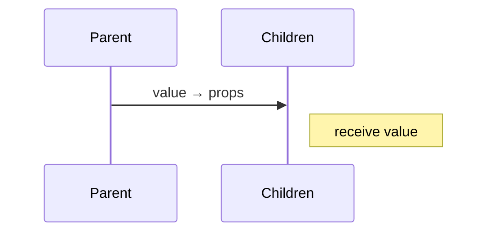
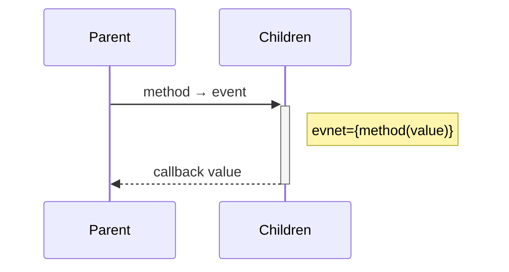

# 传值

传值包含子组件传父组件、父组件传子组件以及跨组件传值，
其中跨组件传值一般由状态处理器（比如`redux`）管理。

## 父传子

父组件调用子组件时将值传入子组件的`props`。

![父传子][parent-children]

> 若图片显示有误请点击 [父传子][parent-children]



## 子传父

子组件的利用`props`调用父组件事件，将子组件的值传送给父组件。

![子传父][children-parent]

> 若图片显示有误请点击 [子传父][children-parent]



## 实例

### 父组件：`Todo`

```jsx
import React, { Component } from 'react';
import TodoItem from './TodoItem';

export class Todo extends Component {
  constructor(props) {
    super(props);
    this.state = {
      title: '',
      items: [],
    };
  }

  inputTitle(e) {
    const title = e.target.value;
    this.setState({  title });
  }

  addItem() {
    const { title, items } = this.state;
    if (!title) return;
    const item = {
      id: Date.now(), // 实际应用由后端分配
      title,
      status: 0
    }
    this.setState({ items: items.concat(item) });
  }

  removeItem(id) {
    const { items } = this.state;
    const index = items.findIndex(item => item.id === id);
    items.splice(index, 1);
    this.setState({ items })
  }

  render() {
    const { items } = this.state;
    return (
      <div>
        <h3>Todo Lists</h3>
        <legend>
          <label htmlFor="item">Title:</label>
          <input id="item" required onChange={e => this.inputTitle(e)} />
          <button onClick={() => this.addItem()}>add</button>
        </legend>
        <ul>
          {items.map(item => (
            <li key={item.id}>
              <TodoItem {...item} onRemove={id => this.removeItem(id)} />
            </li>)
          )}
        </ul>
      </div>
    );
  }
}

export default Todo;
```

### 子组件：`TodoItem`

```jsx
import React, { Component } from 'react';
import PropTypes from 'prop-types';

export class TodoItem extends Component {
  constructor(props) {
    super(props);
  }

  static propTypes = {
    item: PropTypes.object,
    onRemove: PropTypes.func,
  };

  remove() {
    const { id, onRemove } = this.props;
    onRemove(id);
  }

  render() {
    const { id, title, status } = this.props;
    return (
      <>
        <span><input type="checkbox" /></span>
        <span>{id}</span>
        <span>{title}</span>
        <span>{status}</span>
        <span><button onClick={() => this.remove()}>remove</button></span>
      </>
    );
  }
}

export default TodoItem;
```

[parent-children]: https://mermaid.ink/img/eyJjb2RlIjoic2VxdWVuY2VEaWFncmFtXG5QYXJlbnQtPj5DaGlsZHJlbjogdmFsdWUg4oaSIHByb3BzXG5Ob3RlIHJpZ2h0IG9mIENoaWxkcmVuOiByZWNlaXZlIHZhbHVlIiwibWVybWFpZCI6eyJ0aGVtZSI6ImRlZmF1bHQifSwidXBkYXRlRWRpdG9yIjpmYWxzZX0
[children-parent]: https://mermaid.ink/img/eyJjb2RlIjoic2VxdWVuY2VEaWFncmFtXG5QYXJlbnQtPj4rQ2hpbGRyZW46IG1ldGhvZCDihpIgZXZlbnRcbk5vdGUgcmlnaHQgb2YgQ2hpbGRyZW46IGV2bmV0PXttZXRob2QodmFsdWUpfVxuQ2hpbGRyZW4tLT4-LVBhcmVudDogY2FsbGJhY2sgdmFsdWUiLCJtZXJtYWlkIjp7InRoZW1lIjoiZGVmYXVsdCJ9LCJ1cGRhdGVFZGl0b3IiOmZhbHNlfQ
